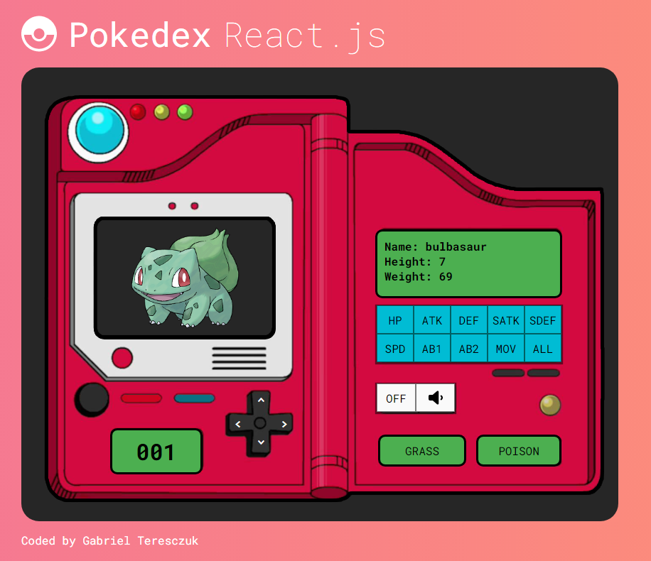

# Pokedex
Proyecto de creacion de una pokedex para usar la API de pokemon y manejar diversos estados en React.js

[Ver demo 👀](https://gabrielteresczuk.github.io/pokedex/)

## Screenshot

## Funciones

 - Listar uno de los 151 pokemon
 - Encender y apagar el dispositivo
 - Activar y desactivar la musica
 - Extraer datos puntuales con cada boton
 - Buscar de a 1 o a 10 segun el numero de id

> Autor - Teresczuk Gabriel
